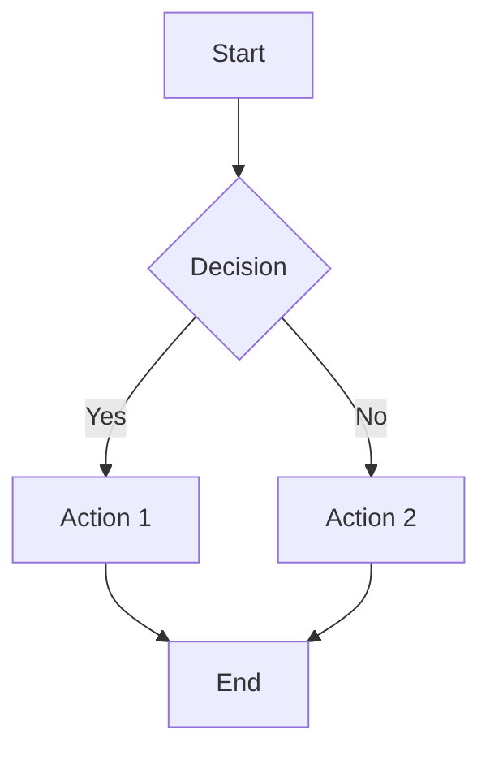
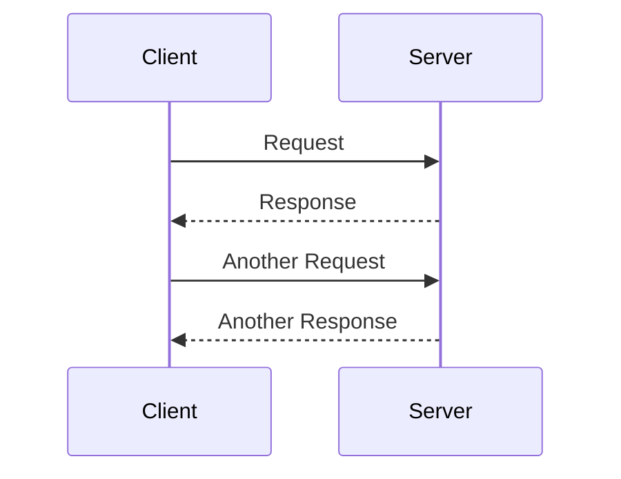
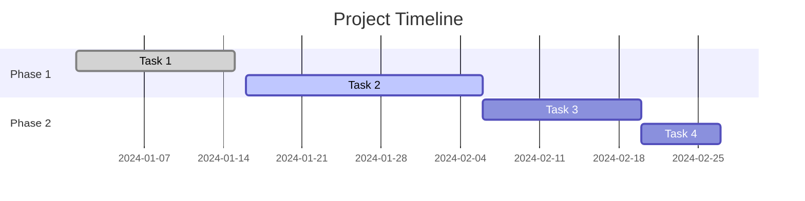

# 🚀 Complete Markdown Reference Guide

[](https://github.com)
[](https://daringfireball.net/projects/markdown/)
[](https://opensource.org/licenses/MIT)

> **Una guía completa de todos los elementos de Markdown con ejemplos prácticos**

---

## 📚 Table of Contents

- [Headers](#-headers)
- [Text Formatting](#-text-formatting)
- [Lists](#-lists)
- [Links](#-links)
- [Images](#-images)
- [Code](#-code)
- [Tables](#-tables)
- [Blockquotes](#-blockquotes)
- [Horizontal Rules](#-horizontal-rules)
- [Line Breaks](#-line-breaks)
- [Escaping Characters](#-escaping-characters)
- [HTML Support](#-html-support)
- [GitHub Flavored Markdown](#-github-flavored-markdown)
- [Advanced Features](#-advanced-features)
- [Footnotes](#-footnotes)
- [Task Lists](#-task-lists)
- [Emojis](#-emojis)
- [Math Expressions](#-math-expressions)

---

## 📋 Headers

```markdown
# H1 Header
## H2 Header  
### H3 Header
#### H4 Header
##### H5 Header
###### H6 Header
```

### Alternative Header Syntax

```markdown
Header Level 1
==============

Header Level 2
--------------
```

---

## 🎨 Text Formatting

### Basic Formatting
- **Bold text**: `**bold**` or `__bold__`
- *Italic text*: `*italic*` or `_italic_`
- ***Bold and italic***: `***bold and italic***`
- ~~Strikethrough~~: `~~strikethrough~~`
- `Inline code`: `` `inline code` ``

### Extended Formatting
- ==Highlighted text== (GitHub): `==highlighted==`
- <mark>HTML highlighted</mark>: `<mark>highlighted</mark>`
- <u>Underlined text</u>: `<u>underlined</u>`
- <sup>Superscript</sup>: `<sup>superscript</sup>`
- <sub>Subscript</sub>: `<sub>subscript</sub>`

### Text Colors (HTML)
<span style="color: red">Red text</span>
<span style="color: #00FF00">Green text</span>
<span style="color: blue">Blue text</span>
<span style="color: #FF6B6B">Custom hex color</span>

```html
<span style="color: red">Red text</span>
<span style="color: #00FF00">Green text</span>
<span style="color: blue">Blue text</span>
```

---

## 📝 Lists

### Unordered Lists
- Item 1
- Item 2
  - Nested item 2.1
  - Nested item 2.2
    - Deep nested item
- Item 3

```markdown
- Item 1
- Item 2
  - Nested item 2.1
  - Nested item 2.2
    - Deep nested item
- Item 3
```

### Alternative Unordered List Syntax
* Using asterisks
* Another item
+ Using plus signs
+ Another item

### Ordered Lists
1. First item
2. Second item
   1. Nested numbered item
   2. Another nested item
3. Third item

### Custom Start Numbers
57. Item starting at 57
58. Next item
59. Another item

```markdown
57. Item starting at 57
58. Next item
59. Another item
```

---

## 🔗 Links

### Basic Links
[Link text](https://www.example.com)
[Link with title](https://www.example.com "This is a title")

### Reference Links
[Reference link][1]
[Another reference][link-reference]

[1]: https://www.example.com
[link-reference]: https://www.example.com "Optional title"

### Automatic Links
<https://www.example.com>
<email@example.com>

### Internal Links
[Go to Headers section](#-headers)
[Go to Tables](#-tables)

---

## 🖼️ Images

### Basic Images


### Images with Title


### Reference Images
![Reference image][image-ref]

[image-ref]: https://via.placeholder.com/250x150/4ecdc4/ffffff?text=Reference+Image "Reference image title"

### HTML Images with Size Control


### Clickable Images
[](https://www.example.com)

---

## 💻 Code

### Inline Code
This is `inline code` within a sentence.
Use `npm install` to install packages.

### Code Blocks

#### Basic Code Block
```
Basic code block without syntax highlighting
This is plain text
```

#### JavaScript
```javascript
function greetUser(name) {
    console.log(`Hello, ${name}!`);
    return `Welcome, ${name}`;
}

const user = "Developer";
greetUser(user);
```

#### Python
```python
def calculate_area(radius):
    """Calculate the area of a circle."""
    import math
    return math.pi * radius ** 2

# Example usage
radius = 5
area = calculate_area(radius)
print(f"Area: {area:.2f}")
```

#### HTML
```html
<!DOCTYPE html>
<html lang="en">
<head>
    <meta charset="UTF-8">
    <title>Example</title>
</head>
<body>
    <h1>Hello World</h1>
    <p>This is a paragraph.</p>
</body>
</html>
```

#### CSS
```css
.container {
    max-width: 1200px;
    margin: 0 auto;
    padding: 20px;
    background: linear-gradient(135deg, #667eea 0%, #764ba2 100%);
}

.button:hover {
    transform: translateY(-2px);
    box-shadow: 0 4px 8px rgba(0,0,0,0.2);
}
```

#### JSON
```json
{
    "name": "Complete Markdown Guide",
    "version": "1.0.0",
    "author": "Developer",
    "dependencies": {
        "markdown": "^2.0.0",
        "highlight.js": "^11.0.0"
    },
    "keywords": ["markdown", "documentation", "guide"]
}
```

#### Bash/Shell
```bash
#!/bin/bash

# Install dependencies
npm install

# Build project
npm run build

# Start development server
npm start

# Environment variables
export NODE_ENV=production
echo "Environment: $NODE_ENV"
```

#### Diff
```diff
function oldFunction() {
-   console.log("Old implementation");
+   console.log("New improved implementation");
+   return true;
}

+ // Added new feature
+ const newFeature = () => {
+     return "Amazing new functionality";
+ };
```

---

## 📊 Tables

### Basic Table
| Column 1 | Column 2 | Column 3 |
|----------|----------|----------|
| Row 1, Col 1 | Row 1, Col 2 | Row 1, Col 3 |
| Row 2, Col 1 | Row 2, Col 2 | Row 2, Col 3 |

### Table with Alignment
| Left Aligned | Center Aligned | Right Aligned |
|:-------------|:--------------:|--------------:|
| Left | Center | Right |
| Text | Text | Text |
| More content | Centered content | Right content |

### Advanced Table with Formatting
| Feature | Status | Priority | Notes |
|---------|:------:|:--------:|-------|
| **Authentication** | ✅ Complete | 🔴 High | OAuth 2.0 implemented |
| *User Dashboard* | 🚧 In Progress | 🟡 Medium | 75% complete |
| ~~Old Feature~~ | ❌ Deprecated | 🔵 Low | Will be removed in v2.0 |
| `API Integration` | ✅ Complete | 🔴 High | RESTful API ready |

### Table with Code and Links
| Language | Framework | Repository | Documentation |
|----------|-----------|------------|---------------|
| JavaScript | React | [GitHub](https://github.com/facebook/react) | [Docs](https://reactjs.org/) |
| Python | Django | [GitHub](https://github.com/django/django) | [Docs](https://docs.djangoproject.com/) |
| TypeScript | Angular | [GitHub](https://github.com/angular/angular) | [Docs](https://angular.io/) |

---

## 💬 Blockquotes

### Basic Blockquote
> This is a blockquote.
> It can span multiple lines.

### Nested Blockquotes
> This is the first level of quoting.
>
> > This is nested blockquote.
> > 
> > > And this is a third level.
>
> Back to the first level.

### Blockquote with Attribution
> "The only way to do great work is to love what you do."
> 
> — Steve Jobs

### Blockquote with Formatting
> **Important Note**: This blockquote contains *formatted* text.
> 
> You can also include `code` and [links](https://example.com) within blockquotes.
> 
> - Even lists work
> - Inside blockquotes

### Special Blockquotes (GitHub Style)
> [!NOTE]
> Useful information that users should know, even when skimming content.

> [!TIP]
> Helpful advice for doing things better or more easily.

> [!IMPORTANT]
> Key information users need to know to achieve their goal.

> [!WARNING]
> Urgent info that needs immediate user attention to avoid problems.

> [!CAUTION]
> Advises about risks or negative outcomes of certain actions.

---

## ➖ Horizontal Rules

Three or more hyphens:
---

Three or more asterisks:
***

Three or more underscores:
___

Horizontal rule with spaces:
- - -

---

## 🔄 Line Breaks

### Single Line Break
This is line one  
This is line two (two spaces at the end of line one)

### Double Line Break

This is paragraph one.

This is paragraph two.

### Manual Line Break
This is line one<br>
This is line two (using HTML br tag)

---

## 🛡️ Escaping Characters

Use backslash to escape special characters:
- \*Not italic\*
- \**Not bold\**
- \# Not a header
- \[Not a link\](url)
- \`Not code\`
- \> Not a blockquote

Special characters that can be escaped:
\\ \` \* \_ \{ \} \[ \] \< \> \( \) \# \+ \- \. \! \| \~

---

## 🌐 HTML Support

### Basic HTML Elements
<div align="center">
    <h3>Centered HTML Header</h3>
    <p><strong>Bold</strong> and <em>italic</em> HTML text</p>
</div>

### HTML with Styling
<div style="background: linear-gradient(90deg, #ff6b6b, #4ecdc4); padding: 20px; border-radius: 10px; color: white; text-align: center;">
    <h4>Styled HTML Block</h4>
    <p>This is HTML with inline CSS styling</p>
</div>

### Details and Summary
<details>
<summary>Click to expand</summary>

This content is hidden by default and revealed when clicking the summary.

```javascript
console.log("Hidden code block");
```

- Hidden list item 1
- Hidden list item 2

</details>

### HTML Tables
<table>
    <thead>
        <tr style="background-color: #f0f0f0;">
            <th>HTML Table</th>
            <th>With Styling</th>
        </tr>
    </thead>
    <tbody>
        <tr>
            <td style="background-color: #ffeeee;">Red cell</td>
            <td style="background-color: #eeffee;">Green cell</td>
        </tr>
    </tbody>
</table>

---

## 🐙 GitHub Flavored Markdown

### Syntax Highlighting
```ruby
require 'redcarpet'
markdown = Redcarpet.new("Hello World!")
puts markdown.to_html
```

### Tables (already covered above)

### Strikethrough (already covered above)

### Autolinked References
- Issue references: #123
- User mentions: @username
- Commit SHA: a5c3785ed8d6a35868bc169f07e40e889087fd2e

### Emoji Support (see Emojis section)

---

## 🚀 Advanced Features

### Keyboard Keys
Press <kbd>Ctrl</kbd> + <kbd>C</kbd> to copy
Use <kbd>⌘</kbd> + <kbd>Space</kbd> on Mac
Press <kbd>Alt</kbd> + <kbd>Tab</kbd> to switch windows

### Abbreviations
*[HTML]: HyperText Markup Language
*[CSS]: Cascading Style Sheets
*[JS]: JavaScript

The HTML specification defines how CSS and JS work together.

### Definition Lists
Term 1
:   Definition for term 1

Term 2
:   Definition for term 2
:   Another definition for term 2

### Progress Bars (HTML)
<progress value="70" max="100">70%</progress>
<progress value="32" max="100">32%</progress>
<progress value="90" max="100">90%</progress>

---

## 📌 Footnotes

Here's a sentence with a footnote[^1].

Here's another footnote[^footnote].

You can also use inline footnotes^[This is an inline footnote].

[^1]: This is the first footnote.
[^footnote]: This is a named footnote with **formatting** and [links](https://example.com).

---

## ✅ Task Lists

### Basic Task Lists
- [x] Completed task
- [x] Another completed task
- [ ] Incomplete task
- [ ] Another incomplete task

### Nested Task Lists
- [x] Main task completed
  - [x] Sub-task 1 completed
  - [x] Sub-task 2 completed
  - [ ] Sub-task 3 pending
- [ ] Another main task
  - [ ] Sub-task A
  - [ ] Sub-task B

### Task Lists with Links and Formatting
- [x] **Setup project** - [Repository](https://github.com)
- [x] *Configure dependencies* - `npm install`
- [ ] ~~Write documentation~~ Write **better** documentation
- [ ] Deploy to production 🚀

---

## 😀 Emojis

### Common Emojis
:smile: :heart: :thumbsup: :fire: :rocket: :star: :warning: :bulb: :gear: :lock:

### GitHub Shortcodes
:octocat: :shipit: :sparkles: :zap: :boom: :collision: :heavy_check_mark: :x: :question: :exclamation:

### Categories
**People**: 😀 😃 😄 😁 😆 😅 😂 🤣 😊 😇
**Nature**: 🌍 🌎 🌏 🌕 🌖 🌗 🌘 🌑 🌒 🌓
**Objects**: 💻 📱 ⌚ 🖥️ 🖨️ ⌨️ 🖱️ 💾 💿 📀
**Symbols**: ✅ ❌ ⚠️ 🔥 💯 ✨ 🚀 💎 🔑 🛡️

---

## 🔢 Math Expressions

### Inline Math
The quadratic formula is $x = \frac{-b \pm \sqrt{b^2-4ac}}{2a}$.

### Block Math
$$
\begin{align}
\nabla \cdot \vec{E} &= \frac{\rho}{\epsilon_0} \\
\nabla \cdot \vec{B} &= 0 \\
\nabla \times \vec{E} &= -\frac{\partial \vec{B}}{\partial t} \\
\nabla \times \vec{B} &= \mu_0\vec{J} + \mu_0\epsilon_0\frac{\partial \vec{E}}{\partial t}
\end{align}
$$

### Mathematical Notation
- Fractions: $\frac{1}{2}$, $\frac{x+1}{x-1}$
- Powers: $x^2$, $e^{i\pi}$
- Roots: $\sqrt{x}$, $\sqrt[3]{x}$
- Greek letters: $\alpha$, $\beta$, $\gamma$, $\Delta$, $\Omega$
- Sums: $\sum_{i=1}^{n} x_i$
- Integrals: $\int_{0}^{\infty} e^{-x} dx$

---

## 🔍 Mermaid Diagrams

### Flowchart


### Sequence Diagram


### Gantt Chart


---

## 📋 Checklists and Best Practices

### Markdown Best Practices Checklist
- [x] Use consistent heading hierarchy
- [x] Add alt text to all images
- [x] Use descriptive link text
- [x] Keep line length reasonable (80-120 characters)
- [x] Use blank lines to separate sections
- [x] Choose consistent list markers
- [x] Escape special characters when needed
- [x] Test links and images
- [x] Use semantic formatting (emphasis vs bold)
- [x] Add table of contents for long documents

### File Organization
```
project/
├── README.md
├── docs/
│   ├── installation.md
│   ├── configuration.md
│   ├── api-reference.md
│   └── troubleshooting.md
├── examples/
│   ├── basic-usage.md
│   └── advanced-features.md
└── assets/
    ├── images/
    └── diagrams/
```

---

## 🏷️ Metadata and Front Matter

```yaml
---
title: "Complete Markdown Guide"
author: "Developer"
date: "2024-12-01"
version: "1.0.0"
tags: ["markdown", "documentation", "guide"]
description: "A comprehensive guide to all Markdown features"
toc: true
---
```

---

## 📚 Resources and References

### Official Documentation
- [Original Markdown](https://daringfireball.net/projects/markdown/)
- [GitHub Flavored Markdown](https://github.github.com/gfm/)
- [CommonMark](https://commonmark.org/)

### Tools and Editors
- **Online Editors**: [Dillinger](https://dillinger.io/), [StackEdit](https://stackedit.io/)
- **Desktop Editors**: Typora, Mark Text, Zettlr
- **IDE Extensions**: VS Code Markdown extensions

### Markdown Flavors
| Flavor | Features | Use Case |
|--------|----------|----------|
| CommonMark | Standard specification | Universal compatibility |
| GitHub Flavored | Tables, task lists, strikethrough | GitHub repositories |
| MultiMarkdown | Citations, math, metadata | Academic writing |
| Pandoc | Advanced formatting | Document conversion |

---

## 🤝 Contributing

Found an error or want to add something? Here's how to contribute:

1. Fork the repository
2. Create a feature branch (`git checkout -b feature/amazing-feature`)
3. Commit your changes (`git commit -m 'Add amazing feature'`)
4. Push to the branch (`git push origin feature/amazing-feature`)
5. Open a Pull Request

---

## 📄 License

This project is licensed under the MIT License - see the [LICENSE](LICENSE) file for details.

---

## 📞 Contact

- **Author**: Tu Nombre
- **Email**: tu-email@example.com
- **GitHub**: [@tu-usuario](https://github.com/tu-usuario)
- **Website**: [tu-sitio-web.com](https://tu-sitio-web.com)

---

<div align="center">
    <p>Made with ❤️ and lots of ☕</p>
    <p>
        <a href="#-complete-markdown-reference-guide">⬆️ Back to Top</a>
    </p>
</div>

---

*Last updated: December 2024*